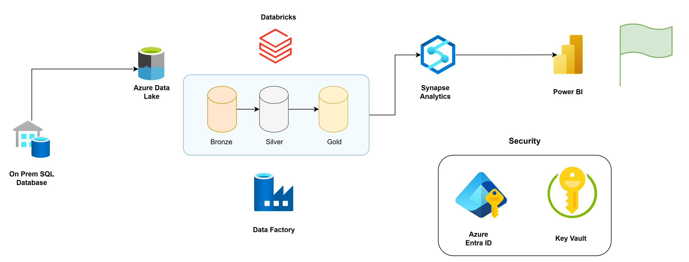
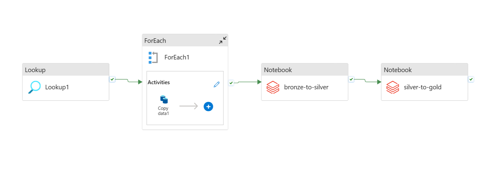
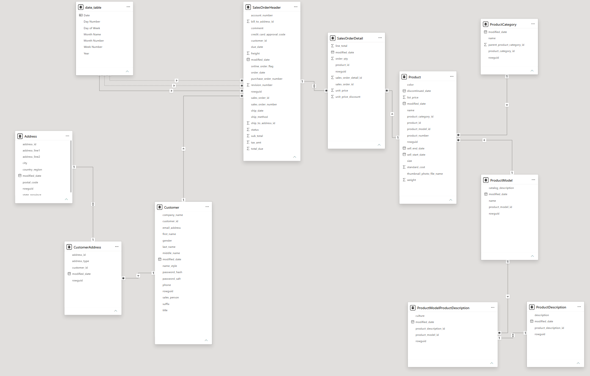
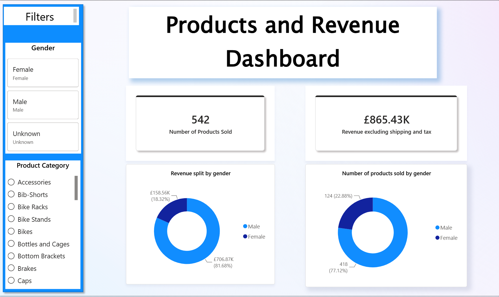

# Azure Data Engineering Pipeline Project

## Introduction

In  this Azure data engineering pipeline project, I set out to build an automated data pipeline moving data from an on-prem SQL database through Azure Data Lake and ending in Microsoft Power BI. I used the public Microsoft dataset named 'Adventure Works 2025'. This is a fictional dataset which represents sales data of a sports retailer called Adventure Works. 
The pipeline was orchestrated using Azure Data Factory.

The full data pipeline diagram can be seen below:

The pipeline in Azure Data Factory can be seen below:

The pipeline ingested data from an on-prem SQL database into Azure Data Lake using the Medallion architecture. Data transformation and transfer within the Medallion architecture was done with Azure Databricks (PySpark). 

Thereafter, the data was loaded into Azure Synapse Analytics using a dynamic SQL script. Finally, I used Power BI to connect to Azure Synapse Analytics and create a data analytics dashboard.

To house the entire project, I set up a Virtual Machine on my computer using Hyper-V. This provided a consistent and isolated environment to run the project. 

## Tools I used

* **Microsoft SQL Server** - the source on-Prem SQL database management system that initially held the data

* **Azure Data Factory** - to orchestrate the ETL pipeline

* **Azure Data Lake** - to store the data in bronze, silver and gold containers according to Medallion architecture

* **Azure Databricks** - the platform to transform and move the data between the bronze, silver and gold containers using PySpark within Jupyter notebooks

* **Apache Spark (PySpark)** - the analytics engine used within Azure Databricks to clean and transform the data. It was accessed via PySpark Python API

* **Azure Synapse Analytics** - to load the data once it had been transformed 

* **Microsoft Power BI** - to visually analyse the data from Azure Synapse Analytics using Star Schema method

* **Microsoft Hyper-V** - to create a virtual machine for the project

## ETL Data Workflow on Medallion Architecture
Below is a description of the end-to-end workflow based on the Medallion architecture. The code files can be accessed at the end of each numbered section.

1. **Ingestion (On-Prem to Bronze)**: 

   * Azure Data Factory ingests data from SQL Server

   * Data is extracted raw and converted to Parquet files in the Bronze Storage Container.

   The JSON output file for this ingestion activity can be accessed [here](code/datafactory/Formatted%20code/FORMATTED_copy_all_tables_from_SQL_copy.json)

2. **Cleansing (Bronze to Silver)**:

   * Azure Databricks (PySpark) reads the raw Bronze data and performs three cleansing tasks
   * First task is that it applies standard formatting to Modified Date column of YYYY-MM-DD
   * Second task is that it enforces this date column to be a Python date object
   * Third task is that it converts all database files from Parquet to Delta and transfers them over to Silver container
   
   The Jupyter Notebook file for this cleansing activity can be accessed [here](code/databricks/bronze-to-silver.ipynb)

3. **Final transformation (Silver to Gold)**:

   * Azure Databricks (PySpark ) reads the Silver data and applies standard column name formatting from Camelcase to Snake case
   
   The Jupyter Notebook file for this cleansing activity can be accessed [here](code/databricks/silver-to-gold.ipynb)

4. **Warehouse Loading & Reporting**:

   * In Azure Synapse Analytics, I executed Dynamic SQL scripts to create Views of each Delta table ensuring original data integrity.

   The SQL file for this loading activity can be accessed [here](code/azure-synapse/gold_create_views_for_all_tables.sql)

   * For visual data analysis, I then connected Microsoft Power BI to Azure Synapse Analytics via the Azure Synapse connector. I then created relationships within all tables according to the Star Schema method. Whilst also creating a Date Table as per standard Data Analyst practice.
   
   The Star Schema can be seen in the below screenshot:
   
     Using the above Star Scehma, I created a Products and Revenue Dashboard with high-level KPI cards and sales performance visualisations.

     This Products and Revenue Dashboard can be seen in the below screenshot:
     

      The Power BI Template file (without the data model to reduce file size) for this data analysis activity can be accessed [here](power-bi/Dashboard_data-engineer.pbit)

## Conclusion
In conclusion, this Azure Data Pipeline project was a great opportunity to practise building a _programmatic_ data pipeline. With my background as a Data Analyst, I initally did all of my ETL work in Power BI. That already gave me a solid grasp of data pipeline principles and allowed me to easily ascertain where all the steps of this data engineering project fit in the bigger picture of the ETL process.
For example: 
- Data Factory was where the Extraction took place.
- Databricks was where the Transformation took place.
- And finally, Azure Synapse Analytics was where the Load took place.

Overall, this project has boosted my confidence in building data pipelines and solidifies my position as both a Data Analyst and Data Engineer.

